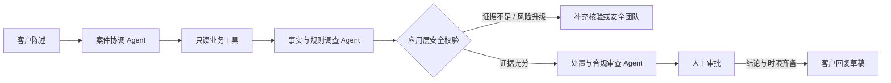

# 金融客诉 AI 协同工作台

> 面向金融客诉专员的 AI 调查与审批协同 Demo：模型负责理解、归纳与提出受约束建议；系统负责证据、权限、规则和资金动作边界。


## 为什么做它

金融客诉不是“让模型写一段安抚话术”。提前结清后扣款、重复还款、疑似未授权交易同时涉及账务事实、规则适用、资金风险和对客沟通边界。本项目将 AI 放进可审计工作流，而非让它直接做资金决策。

目标用户是一线客诉专员与审批人员：先核事实，再形成带证据引用的建议，自动进入审批；只有审批结论和时限齐备后才生成客户回复。

## 核心能力

- **三 Agent 协作**：案件协调、事实与规则调查、处置与合规审查；每阶段可查看脱敏输入/输出摘要、耗时与指标。
- **8 类只读工具**：客户、贷款、计划、交易、提前还款、工单、安全事件和规则查询；模型没有写入或资金操作权限。
- **证据与规则约束**：模型结论必须引用实际工具记录；应用层校验证据 ID、来源、规则、资金建议和交易关系。
- **审批后回复**：资金建议只能待审批；审批包含结论、完成时间和执行时限后，才允许生成不暴露内部术语的客户回复。
- **冻结评测**：合成样本、评分标准与批次在模型调用前以 SHA-256 冻结；不保存供应商原始响应。

## 工作流



详见 [架构说明](docs/ARCHITECTURE.md)。

## 快速开始

```bash
npm install
cp .env.example .env.local
npm run dev
```

默认可使用稳定演示模式，不需要 API Key。真实 GLM 调查需要在 `.env.local` 配置 `GLM_API_KEY`；密钥只在服务端使用，不应提交到 Git。

```bash
npm run typecheck
npm run lint
npm run test:offline
npm run build
```

## 评测与当前结果

| 层级 | 验证内容 | 当前状态 |
| --- | --- | --- |
| 离线安全与契约测试 | Provider、数据外发、工具权限、Schema、审批与边界 | 通过 |
| 真实代码护栏 | 资金建议、证据绑定、跨客户隔离等确定性约束 | 通过 |
| 冻结 GLM 泛化评测 | 新合成样本的端到端结构与业务动作校验 | V6：9/12 机器通过 |

V6 在首次模型请求前冻结，12 个样本全部端到端完成，36 个 Agent 阶段输出均通过结构化校验。75.0% 是当前合成冻结集的内部工程观测，不是生产准确率、独立基准或金融业务承诺。详见 [评测口径](docs/EVALUATION.md)与[脱敏计分卡](evals/model-candidates-v6-scorecard.md)。

## 技术栈

- Next.js / TypeScript / Vinext
- 服务端结构化模型调用与 JSON Schema 校验
- 智谱 GLM-5.3-Flash（可选）
- 本地合成业务数据、确定性安全校验与离线测试

## 数据与安全

- 案件、客户、贷款、交易、工单与规则均为**虚构或脱敏演示数据**，不对应真实机构或个人。
- 本项目不连接真实核心系统，不执行支付、退款、账户冻结或任何资金动作。
- 模型仅可访问已授权的合成评测样本与必要模拟账务/规则数据，可由服务端开关暂停外发。
- 不提交 API Key、原始模型响应、真实客户资料或生产规则。

## 项目边界与路线图

当前版本聚焦“可解释调查 + 合规审批”的闭环演示。后续计划补齐持久化、角色权限、相似案例检索、运营看板与更严格的独立人工复核；这些能力尚未实现，不应被视为生产可用承诺。

## 目录

```text
app/                 页面与 API 路由
components/          工作台与 UI 组件
lib/server/          Agent 编排、只读工具、模型适配与安全校验
evals/               V6 冻结评测集、SHA 锁与脱敏计分卡
scripts/             离线测试与真实模型评测脚本
docs/                架构与评测口径
```

## 使用限制

仅用于学习、作品集展示和原型验证。不得据此作出真实信贷、支付、退款、账户安全或合规决策。

## 许可证

代码使用 [MIT License](LICENSE)；项目中的案例、指标与界面仅代表合成数据原型。
