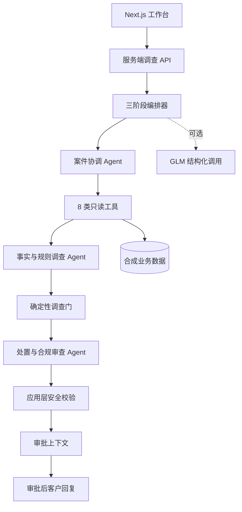

# 架构与安全边界

## 设计原则

模型负责语言理解、证据归纳和待审批建议；应用负责数据范围、工具权限、跨客户隔离、证据引用、规则绑定、资金动作和审批门槛。

## 系统结构

## Agent 职责

| Agent | 输入 | 输出 | 不拥有的权限 |
| --- | --- | --- | --- |
| 案件协调 | 客户陈述、案件元信息 | 业务类型、风险、工具计划 | 最终处置、资金操作 |
| 事实与规则调查 | 已授权工具结果 | 事实、时间线、证据门、冲突和规则 | 编造记录、资金决策 |
| 处置与合规审查 | 已校验调查结果 | 待审批建议、审批层级、回复约束 | 执行退款、直接回复客户 |

## 安全控制点

1. 服务端密钥隔离：浏览器不接触模型 Key；
2. 数据外发白名单：仅登记的合成、脱敏评测案例可进入真实模型调用；
3. 只读工具层：模型不能读取项目文件或调用资金接口；
4. Schema 投影：未知字段和供应商原始响应不进入结果；
5. 证据/规则校验：来源记录、证据 ID、规则 ID 必须来自本次工具结果；
6. 资金动作门：不满足证据、关联、金额和规则约束时降级为补充信息或人工复核；
7. 审批与对客隔离：审批前不生成结论式回复，回复不包含内部规则、审批级别或 Agent 名称。

## 非目标

- 不接入真实金融机构数据或生产核心系统；
- 不执行退款、支付、冻结或账户操作；
- 不把模型输出当作法律、合规或金融意见；
- 不将评测成绩表述为生产准确率。
